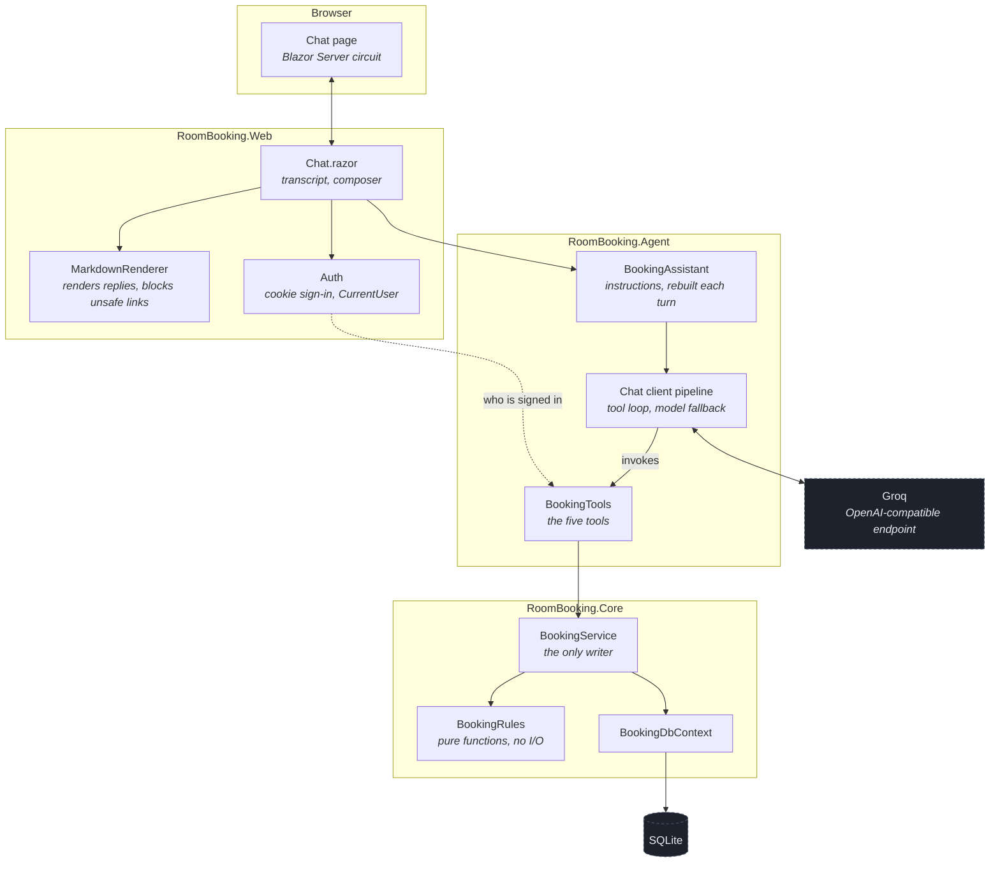
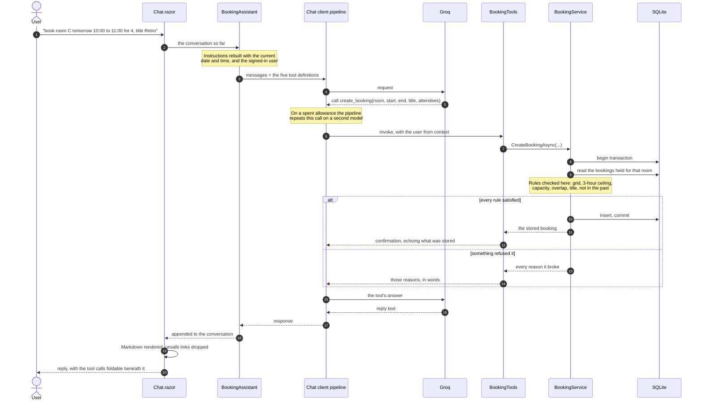

# Component diagram

<b>🇪🇸 Leer en español</b>

 

Dos vistas. La primera es de qué está hecha la solución; la segunda, qué pasa entre que se hace una
pregunta y aparece una respuesta. **Los diagramas están más abajo** — los nombres de los nodos son
identificadores del código, así que no se traducen.

Escritos en Mermaid en vez de exportados de una herramienta de dibujo, así viven con el código,
cambian en el mismo commit, y GitHub los renderiza directo. Un diagrama que puede quedar
desactualizado en silencio es peor que no tener ninguno.

### Sobre el primer diagrama

**La flecha que más importa es la que falta: no hay ninguna que vaya del modelo a la base de
datos.** Toda escritura pasa por `BookingService`, que pone `BookingRules` adelante. El modelo puede
pedir cualquier cosa; no puede hacer nada verdadero.

La flecha punteada es la otra deliberada. El usuario logueado llega a las herramientas desde el
estado de autenticación, nunca como argumento de una herramienta. Como parámetro, mandar otro
identificador alcanzaría para reservar o cancelar a nombre de otra persona.

### Sobre el segundo diagrama

**Paso 3 — las instrucciones se reconstruyen, no se reusan.** Llevan la fecha y hora actuales.
Construidas una vez por conversación, una sesión abierta cruzando la medianoche resolvería "mañana"
contra el día en que empezó mientras siga abierta.

**Pasos 5 a 7 — el loop puede correr varias veces.** El asistente suele llamar a
`list_available_rooms` antes que a `create_booking`, así que el modelo, el pipeline y las
herramientas se turnan hasta que el modelo tiene lo que necesita. El transcript muestra cuántas
llamadas hubo, plegadas debajo de cada respuesta.

**Paso 9 — el usuario viene del contexto.** `BookingTools` lo lee del circuito autenticado, no de
los argumentos del modelo.

**Pasos 11 a 13 — una sola transacción.** El chequeo de solapamiento y el insert se serializan
juntos. Los rangos solapados no se pueden expresar como índice único, así que esto es lo que impide
que dos pedidos simultáneos encuentren libre el mismo hueco. Si la espera por el lock es demasiado
larga, el pedido se rechaza limpiamente en vez de quedar colgado.

**Paso 20 — la respuesta se trata como entrada hostil.** Es Markdown de un modelo que acaba de leer
entrada del usuario y salida de herramientas, incluyendo títulos de reservas que escribió otra
gente. El HTML crudo se escapa y los destinos de links se restringen a `http`, `https`, `mailto` y
rutas relativas.

---

Two views. The first is what the solution is made of; the second is what happens between a
question being asked and an answer appearing.

Written in Mermaid rather than exported from a drawing tool, so it lives with the code, changes
in the same commit, and renders directly on GitHub. A diagram that can drift out of date silently
is worse than none.

---

## What the pieces are

The arrow that matters most is the one that is missing: **nothing goes from the model to the
database**. Every write passes through `BookingService`, which puts `BookingRules` in front of it.
The model can ask for anything; it cannot make anything true.

The dotted arrow is the other deliberate one. The signed-in user reaches the tools from the
authentication state, never as a tool argument. As a parameter, supplying a different identifier
would be enough to book or cancel on somebody else's behalf.

---

## What happens in one turn

### Notes on the path

**Step 3 — the instructions are rebuilt, not reused.** They carry the current date and time. Built
once per conversation, a session left open across midnight would resolve "tomorrow" against the day
it started for as long as it stayed open.

**Steps 5 to 7 — the loop may run several times.** The assistant often calls `list_available_rooms`
before `create_booking`, so the model, the pipeline and the tools trade turns until the model has
what it needs. The transcript shows how many calls ran, folded away beneath each reply.

**Step 9 — the user comes from context.** `BookingTools` reads it from the signed-in circuit, not
from the model's arguments.

**Steps 11 to 13 — one transaction.** The overlap check and the insert are serialised together.
Overlapping ranges cannot be expressed as a unique index, so this is what keeps two simultaneous
requests from both finding the same slot free. If the wait for the lock is too long, the request is
refused cleanly rather than left hanging.

**Step 20 — the reply is treated as hostile input.** It is Markdown from a model that has just read
user input and tool output, including booking titles other people wrote. Raw HTML is escaped and
link targets are restricted to `http`, `https`, `mailto` and relative paths.
